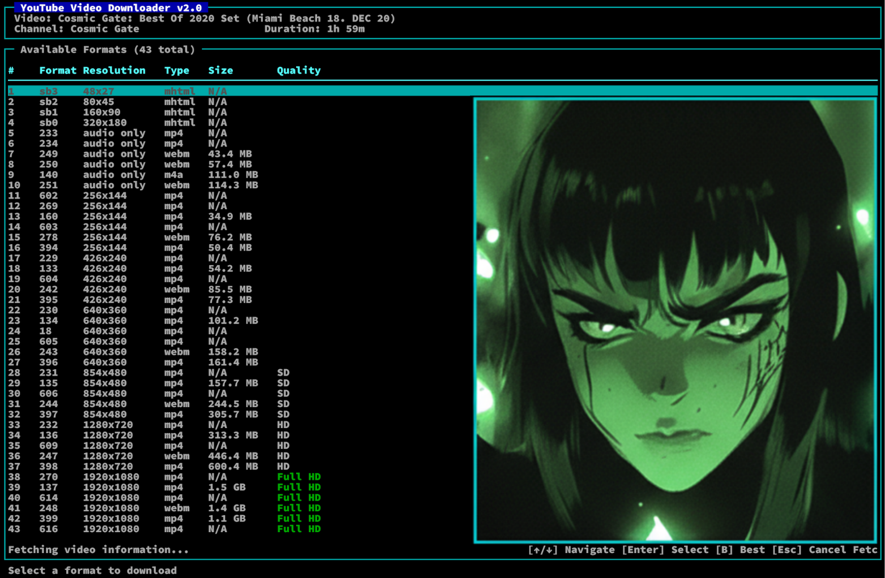

# YouTube Video Downloader (ytdl)

A powerful command-line YouTube video downloader with an interactive Terminal User Interface (TUI) built in C using yt-dlp.



## 🚀 Features

### Core Functionality
- **Fast Downloads**: Uses yt-dlp for reliable video downloading
- **Format Selection**: Interactive format selection with detailed information
- **Quality Options**: Choose from available resolutions, codecs, and file sizes
- **Flexible Output**: Custom output directories with organized file naming
- **Progress Tracking**: Real-time download progress in TUI mode

### Terminal User Interface (TUI)
- **Interactive Navigation**: Arrow key navigation through available formats
- **Visual Selection**: Highlighted selection with real-time updates
- **Clean Interface**: Professional ncurses-based interface
- **Progress Display**: Download progress with completion status
- **Responsive Design**: Adapts to terminal size and color support

### Technical Features
- **Cross-Platform**: Works on Linux, macOS, and other Unix-like systems
- **Memory Safe**: Comprehensive error handling and memory management
- **Clean Architecture**: Modular design with clear separation of concerns
- **Robust Parsing**: JSON format parsing with jansson library
- **Secure Execution**: Safe external command execution with proper error handling

## 📋 Table of Contents

- [Installation](#installation)
- [Dependencies](#dependencies)
- [Building](#building)
- [Usage](#usage)
- [Examples](#examples)
- [TUI Features](#tui-features)
- [Command Line Options](#command-line-options)
- [Configuration](#configuration)
- [Troubleshooting](#troubleshooting)
- [Contributing](#contributing)
- [License](#license)

## 🔧 Installation

### Prerequisites
- GCC compiler (C11 standard support)
- Make build system
- yt-dlp (latest version recommended)

### Quick Install
```bash
# Clone the repository
git clone https://github.com/yourusername/youtube-video-downloader.git
cd youtube-video-downloader

# Build the project
make clean && make
```

## 📦 Dependencies

### Required
- **yt-dlp**: YouTube downloader backend
  ```bash
  # Install yt-dlp
  curl -L https://github.com/yt-dlp/yt-dlp/releases/latest/download/yt-dlp -o /usr/local/bin/yt-dlp
  chmod a+rx /usr/local/bin/yt-dlp
  ```

- **jansson**: JSON parsing library
  ```bash
  # Ubuntu/Debian
  sudo apt-get install libjansson-dev

  # macOS (with Homebrew)
  brew install jansson

  # CentOS/RHEL/Fedora
  sudo dnf install jansson-devel
  ```

### Optional (for TUI)
- **ncurses**: Terminal user interface
  ```bash
  # Ubuntu/Debian
  sudo apt-get install libncurses5-dev libncursesw5-dev

  # macOS (with Homebrew)
  brew install ncurses

  # CentOS/RHEL/Fedora
  sudo dnf install ncurses-devel
  ```

## 🏗️ Building

The project uses GNU Make for building:

```bash
# Build with TUI support (if ncurses is available)
make

# Build without TUI (fallback mode)
make USE_NCURSES=0

# Clean build artifacts
make clean

# Rebuild from scratch
make clean && make
```

### Build Options
- **Automatic Detection**: Makefile automatically detects ncurses availability
- **Fallback Mode**: Builds without TUI if ncurses is not found
- **Debug Builds**: Add `-g` flag for debugging symbols
- **Optimization**: Add `-O2` for release builds

## 🎯 Usage

### Basic Usage
```bash
# Download to current directory
./ytdl "https://www.youtube.com/watch?v=VIDEO_ID"

# Download to specific directory
./ytdl -o /path/to/downloads "https://www.youtube.com/watch?v=VIDEO_ID"

# Show help
./ytdl --help
```

### TUI Mode (Interactive)
When ncurses is available, the program launches an interactive TUI:

1. **Video Information Display**: Shows title, channel, duration
2. **Format Selection**: Navigate available formats with arrow keys
3. **Download Progress**: Real-time progress tracking
4. **Clean Completion**: Returns to normal terminal after download

### Text Mode (Fallback)
When ncurses is not available, uses text-based format selection:

```
Available formats:
1. 137 - 1920x1080 (mp4) - 1.5 GB
2. 136 - 1280x720 (mp4) - 313 MB
3. 135 - 854x480 (mp4) - 157 MB
...

Enter format code (blank for best):
```

## 📝 Examples

### Download Best Quality
```bash
./ytdl "https://www.youtube.com/watch?v=dQw4w9WgXcQ"
```

### Download to Specific Directory
```bash
./ytdl -o ~/Videos "https://www.youtube.com/watch?v=dQw4w9WgXcQ"
```

### Download Playlist
```bash
./ytdl "https://www.youtube.com/playlist?list=PLAYLIST_ID"
```

### Download Audio Only
```bash
# In TUI mode, select audio-only formats
./ytdl "https://www.youtube.com/watch?v=dQw4w9WgXcQ"
```

## 🖥️ TUI Features

### Navigation
- **↑/↓ Arrow Keys**: Navigate through available formats
- **Enter**: Select current format and start download
- **q/Esc**: Cancel and exit

### Visual Interface
```
┌─ YouTube Video Downloader v2.0 ──────────────────────────────────────┐
│ Video: Rick Astley - Never Gonna Give You Up                     │
│ Channel: Rick Astley Official                                   │
│ Duration: 3:32                                                  │
└─────────────────────────────────────────────────────────────────────┘
┌─ Available Formats (15 total) ──────────────────────────────────────┐
│#    Format   Resolution   Type   Size       Quality               │
│─────────────────────────────────────────────────────────────────────┤
│1    137      1920x1080    mp4    1.5 GB     Full HD                │
│2    136      1280x720     mp4    313 MB     HD                     │
│3    135      854x480      mp4    157 MB     SD                     │
│4    140      audio only   m4a    111 MB     Audio Only             │
└─────────────────────────────────────────────────────────────────────┘
┌─ Download Progress ──────────────────────────────────────────────────┐
│ Stage: Preparing download...                                        │
│ Downloaded: 0 B / 1.5 GB                                            │
│ [██████████████████████████████░░░░░░░░░░░░░] 60%     │
│ Elapsed: 2m 15s | ETA: 1m 30s                                      │
└───────────────────────────────────────────────────────────────────────┘
```

### Format Information
- **Format Code**: yt-dlp format identifier
- **Resolution**: Video resolution (e.g., 1920x1080)
- **Type**: File format (mp4, webm, m4a, etc.)
- **Size**: File size estimate
- **Quality**: Quality indicator (4K, Full HD, HD, SD, Audio Only)

## ⚙️ Command Line Options

| Option | Long Form | Description |
|--------|-----------|-------------|
| `-h` | `--help` | Display help message and exit |
| `-o` | `--output PATH` | Specify output directory (default: current directory) |

## 🔧 Configuration

### Environment Variables
- **TERM**: Terminal type (affects TUI rendering)
- **COLUMNS/LINES**: Terminal dimensions (auto-detected)

### File Locations
- **Output Directory**: Specified with `-o` flag or current directory
- **File Naming**: `%(title)s.%(ext)s` (yt-dlp default)

### Terminal Requirements
- **Minimum Size**: 80x24 characters
- **Color Support**: Optional (automatic detection)
- **Unicode Support**: Recommended for special characters

## 🔧 Troubleshooting

### Build Issues

**ncurses not found:**
```bash
# Install ncurses development libraries
sudo apt-get install libncurses5-dev libncursesw5-dev
```

**jansson not found:**
```bash
# Install jansson development libraries
sudo apt-get install libjansson-dev
```

### Runtime Issues

**TUI not working:**
- Check if ncurses is installed
- Try running in a different terminal (xterm, gnome-terminal, etc.)
- Check `TERM` environment variable

**Download fails:**
- Ensure yt-dlp is installed and up-to-date
- Check internet connection
- Verify YouTube URL is valid
- Try updating yt-dlp: `yt-dlp -U`

**Permission errors:**
- Check write permissions for output directory
- Ensure yt-dlp has execute permissions

### Debug Mode
```bash
# Build with debug symbols
make CFLAGS="-g -O0"

# Run with debug output
gdb ./ytdl
```

## 🤝 Contributing

### Development Setup
```bash
# Fork and clone the repository
git clone https://github.com/yourusername/youtube-video-downloader.git
cd youtube-video-downloader

# Create feature branch
git checkout -b feature/your-feature

# Build and test
make clean && make
./ytdl --help
```

### Commit Guidelines
- Use descriptive commit messages
- Reference issue numbers when applicable
- Keep commits focused and atomic
- Test before committing

### Pull Request Process
1. Update documentation for any new features
2. Add tests for new functionality
3. Ensure all existing tests pass
4. Update README.md if needed
5. Request review from maintainers

## 📄 License

```
- May you do good and not evil.
- May you find forgiveness for yourself and forgive others.
- May you share freely, never taking more than you give.
```

## 🙏 Acknowledgments

- **yt-dlp**: For the excellent YouTube downloading backend
- **jansson**: For JSON parsing capabilities
- **ncurses**: For terminal user interface functionality
- **GNU**: For development tools and standards

---

**Happy Downloading!** 🎥📥
